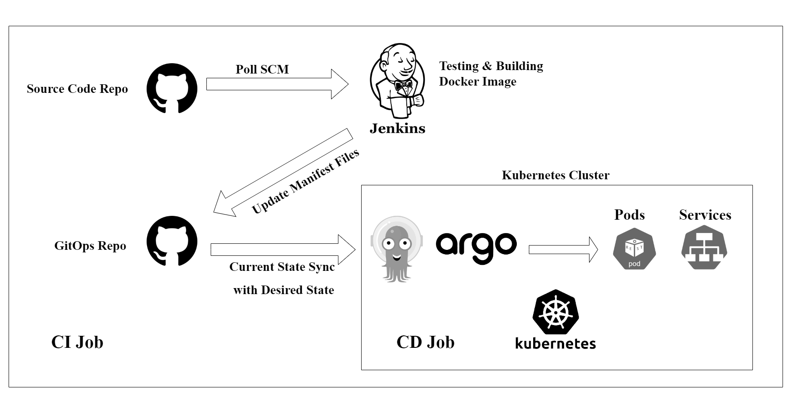

# Complete Instructions for this project!!

<div align="center">
  <p align="center">Pipeline Flow</p>
</div>


# EKS and ArgoCD Setup Guide

## Step 1: Create an EKS Role
- Navigate to AWS services and select 'EKS-cluster.'
- Proceed to the next step and provide the name `EKS-role`.

## Step 2: Create an EC2 Role for EKS
- Create a new role under AWS services, choose `EC2`.
- Attach the following policies:
  - `AmazonEC2ContainerRegistryReadOnly`
  - `AmazonEKS_CNI_Policy`
  - `AmazonEBSCSIDriverPolicy`
  - `AmazonEKSWorkerNodePolicy`
- Name this role `EKS-EC2-Role`.

## Step 3: Create an EKS Cluster
- Navigate to the EKS service and create a new cluster.
- Specify the cluster name, version, and role (which will be automatically fetched).
- Use the default VPC and other settings.
- Configure the security group (SG) to allow the necessary ports for a Kubernetes cluster.
- Note: The setup process will take approximately 10 minutes.

## Step 4: Add a Node Group
- Access your cluster and navigate to the `Compute` section.
- Add a node group and select the default options.

## Step 5: Configure Kubernetes and Install ArgoCD
- Open the Cloud Shell in the same region as your cluster.
- Configure Kubernetes and install ArgoCD using the official [ArgoCD installation page](https://github.com/argoproj/argo-cd/releases).
  ```bash
  aws eks update-kubeconfig --name Argo-CD --region us-east-2
  alias k=kubectl
  k create namespace argocd
  k apply -n argocd -f https://raw.githubusercontent.com/argoproj/argo-cd/v2.11.0/manifests/install.yaml

### **Step 6: Expose ArgoCD Server via LoadBalancer**
 - After installing ArgoCD, the argocd-server service is implemented with a Cluster-IP. 
 - To access it, convert the Cluster-IP to a LoadBalancer by either editing the service or using a patch command.
  ```bash
  kubectl config set-context --current --namespace=argocd 
  k edit svc argocd-server #change from cluster IP to LoadBalancer
  #or by
  k patch svc argocd-server -p '{"spec:" {"type": "LoadBalancer"}}'
  ```
### **Step 7: Retrieve LoadBalancer URL and Admin Credentials**
 - Get the URL of the LoadBalancer and the admin credentials to log in to the ArgoCD server. 
 - Enter the URL in your browser and proceed even if it shows a warning.
 ```bash
  k get secrets
  k get secret argocd-initial-admin-secret -o jsonpath="{.data.password}" | base64 -d
  #userid by default is 'admin'
  #passwd is 'pTPemEUwCykDx3ox'
  ```
 - Change the password after logging in for the first time, then sign out and sign back in with the new credentials.
### **Step 8: Create a New Application in ArgoCD**
 - In the ArgoCD portal, create a new application from the GitHub repository. Ensure that the repository and Docker image are public. Note that the application name should be in lowercase; otherwise, the namespace won't be created.
 - Check the URL and wait for some time for the application to be accessible.
### **Step 9: Secure the Repository**
 -  To avoid unnecessary commits, create a branch and make a pull request. The architect must approve the merge into the main branch.
### **Step 10:**
 - ArgoCD CLI is also available. You can install it and perform application creation via the CLI as well.
